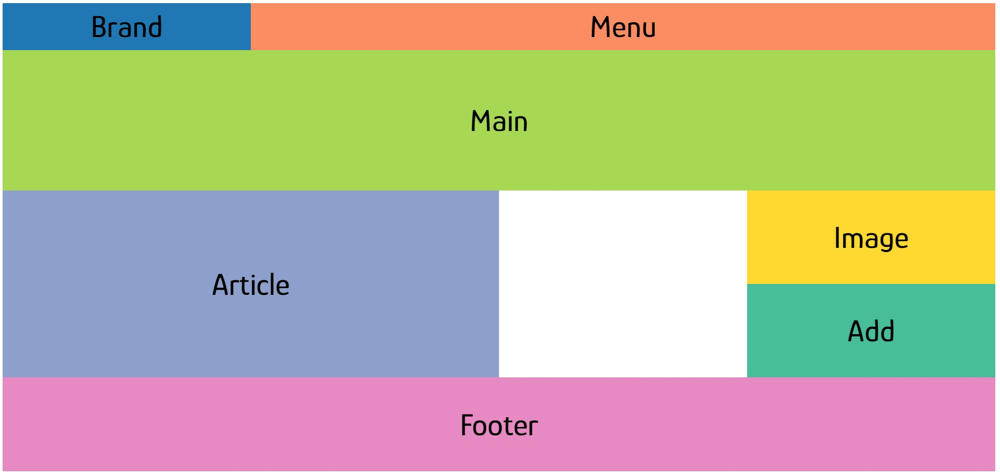
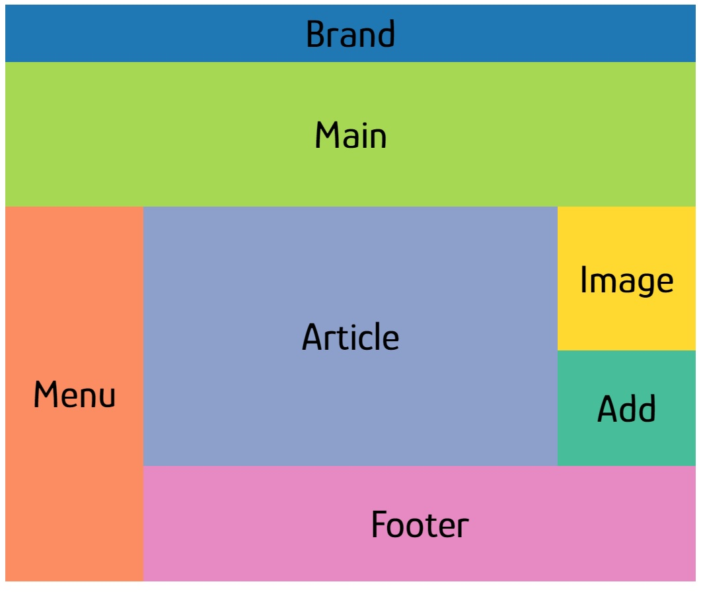
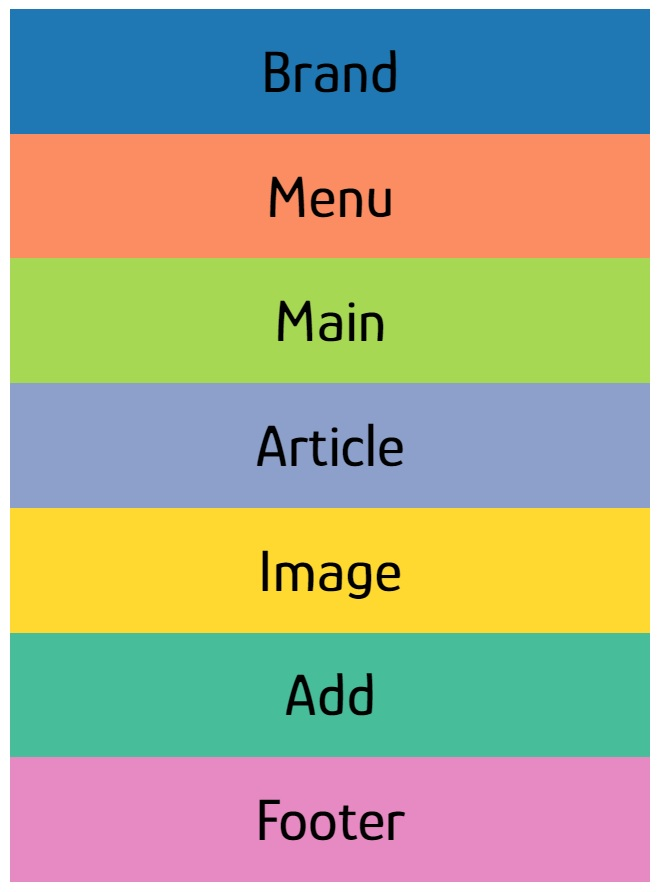

# CSS GRID
* Practising layouts for different devices with CSS GRID.

## Resources Used
&nbsp; 
&nbsp;

&nbsp;

# Layouts for different devices

## Desktop

&nbsp;

## Tablet

&nbsp;

## Cell Phone

&nbsp;

