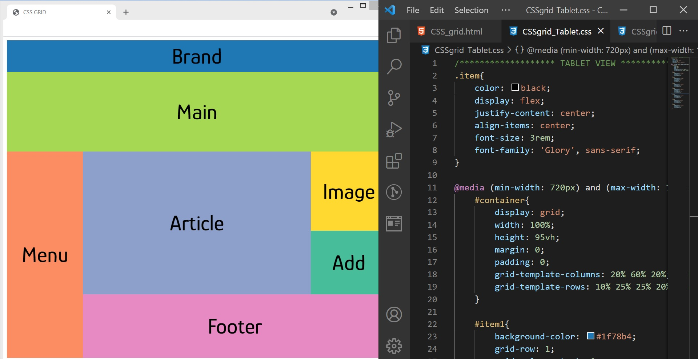
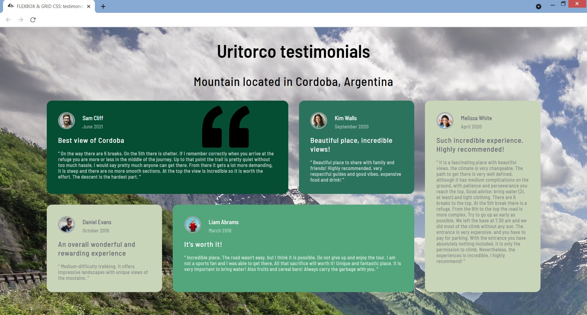

# My webdev repository

My first steps in the Full Stack Web Dev...

## In this repository you could find:

## [Contact card](https://github.com/melisadigiacomo/webdev/tree/master/contact_card)
* Developed a personal contact card with HTML and CSS.

&nbsp;

## [Links pages](https://github.com/melisadigiacomo/webdev/tree/master/links-page)
* Developed two different links pages: (A) Linktree™ clone and (B) icon links page.

https://user-images.githubusercontent.com/87764919/132596527-738298e7-a96d-491a-b1c0-954e8073360b.mp4

## [Hamburger menu using HTML and CSS](https://github.com/melisadigiacomo/webdev/tree/master/navbar-responsive)
* Developed a responsive navbar using HTML and CSS.

https://user-images.githubusercontent.com/87764919/133464505-95c82567-93ac-4d79-a124-8753eede679f.mp4

## [Hamburger menu using JavaScript](https://github.com/melisadigiacomo/webdev/tree/master/navbar-responsive-js)
* Made a responsive navbar using toggle() method in JS.

## [CSS GRID](https://github.com/melisadigiacomo/webdev/tree/master/CSSgrid)
* Practising layouts for different devices with CSS GRID.

&nbsp;

## [CSS FLEXBOX & GRID](https://github.com/melisadigiacomo/webdev/tree/master/CSS_FLEXBOX%26GRID)
* CSS Grid and Flexbox to display testimonials of Uritorco mountain located in Argentina.

&nbsp;

## [GitHub username search app](https://github.com/melisadigiacomo/webdev/tree/master/GitHub-users-search)
* Developed a username search app using JavaScript and Github API.

## [WAVES: CSS animation](https://github.com/melisadigiacomo/webdev/tree/master/waves_CSSanimation)
* Playing around with some CSS {animation} to create waves.

https://user-images.githubusercontent.com/87764919/131514088-8fcc1923-30bb-4e0f-87ac-77d3bf79ed8a.mp4

## [CSS Pac-man {transition} vs {animation}](https://github.com/melisadigiacomo/webdev/tree/master/transition-animation)
* Compared two different properties of CSS using Pac-man.

https://user-images.githubusercontent.com/87764919/133172850-a1921b9f-297d-4c18-baeb-4475ea16ccdd.mp4

## [CSS ART](https://github.com/melisadigiacomo/webdev/tree/master/CSSArt_christmastree)
* Christmas tree with pure CSS.

